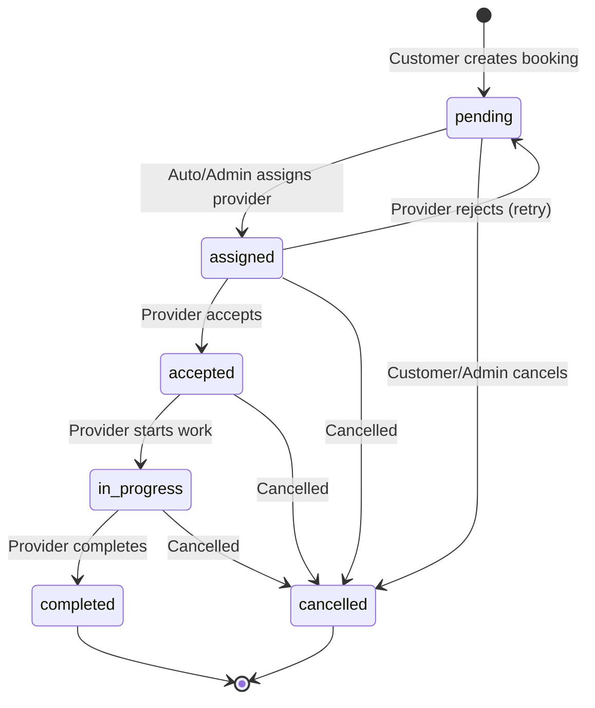

# CleanFanatics - Home Services Booking System

A full-stack MERN application for booking on-demand home services like cleaning, plumbing, electrical work, and more.

## 🚀 Tech Stack

- **Frontend**: React 18, Redux Toolkit, React Router, Tailwind CSS
- **Backend**: Node.js, Express.js, MongoDB, JWT Authentication
- **Key Features**: Event sourcing, smart provider assignment, role-based access

---

## 📁 Project Structure

```
cleanfanatics/
├── client/                 # React Frontend
│   ├── src/
│   │   ├── components/     # Reusable UI components
│   │   ├── pages/          # Route pages (customer, provider, admin)
│   │   ├── store/          # Redux slices
│   │   └── services/       # API service layer
│   └── package.json
├── server/                 # Express Backend
│   ├── models/             # MongoDB schemas
│   ├── routes/             # API endpoints
│   ├── services/           # Business logic
│   ├── middleware/         # Auth middleware
│   ├── seed.js             # Database seeder
│   └── package.json
└── README.md
```

---

## 🛠️ Setup Instructions

### Prerequisites
- Node.js v18+
- MongoDB (local or Atlas)

### 1. Clone & Install

```bash
# Install backend dependencies
cd server
npm install

# Install frontend dependencies
cd ../client
npm install
```

### 2. Configure Environment

Create `server/.env`:
```env
MONGODB_URI=mongodb://localhost:27017/cleanfanatics
JWT_SECRET=your-secret-key-here
PORT=5000
```

### 3. Seed Database (Test Data)

```bash
cd server
npm run seed
```

This creates:
- 1 Admin, 2 Customers, 4 Providers
- 3 Sample bookings (completed, in-progress, pending)

### 4. Run the Application

```bash
# Terminal 1 - Backend
cd server
npm run dev

# Terminal 2 - Frontend
cd client
npm run dev
```

Open http://localhost:5173

---

## 🔑 Test Accounts

| Role | Email | Password |
|------|-------|----------|
| Admin | admin@cleanfanatics.com | admin123 |
| Customer | customer@test.com | customer123 |
| Provider | provider1@test.com | provider123 |

---

## 🎯 Design Decisions

### 1. Event Sourcing for Audit Trail
Every booking state change is logged in `EventLog` collection, enabling:
- Complete audit history
- Debugging failed bookings
- Analytics on booking lifecycle

### 2. Smart Provider Assignment
Providers are auto-assigned based on:
- Service type match
- City/location match
- Availability status
- Rating (highest first)
- Workload (fewer active jobs preferred)

### 3. Booking State Machine
Strict state transitions prevent invalid operations:
```
pending → assigned → accepted → in-progress → completed
     ↓         ↓          ↓           ↓
  cancelled  rejected  cancelled  cancelled
```
Admins can override any transition.

### 4. Role-Based Architecture
Three distinct user experiences:
- **Customer**: Book services, track status, cancel bookings
- **Provider**: Accept/reject jobs, toggle availability, complete work
- **Admin**: Override statuses, view all bookings, access event logs

---

## ⚖️ Trade-offs

| Decision | Trade-off |
|----------|-----------|
| MongoDB over SQL | Flexible schema but no ACID transactions across collections |
| JWT over Sessions | Stateless & scalable, but can't invalidate tokens server-side |
| Redux Toolkit | More boilerplate but predictable state management |
| Auto-assignment | Simple algorithm; real system needs distance calculation |
| No real-time updates | Used polling; WebSockets would be better for production |

---

## 📝 Assumptions

1. **Single city focus**: Providers serve their registered city only
2. **No payment integration**: Prices are estimates only
3. **Trust-based completion**: Provider marks job complete without customer confirmation
4. **Simple scheduling**: No conflict detection for same-day bookings
5. **English only**: No i18n/localization

---

## 🔌 API Endpoints

### Auth
- `POST /api/auth/register` - Create account
- `POST /api/auth/login` - Get JWT token
- `GET /api/auth/me` - Current user info

### Bookings
- `GET /api/bookings` - List bookings (filtered by role)
- `POST /api/bookings` - Create booking (auto-assigns provider)
- `GET /api/bookings/:id` - Booking details
- `GET /api/bookings/:id/history` - Event timeline
- `PATCH /api/bookings/:id/status` - Update status
- `PUT /api/bookings/:id/assign` - Assign provider
- `POST /api/bookings/:id/cancel` - Cancel booking

### Providers
- `GET /api/providers/available` - List available providers
- `PATCH /api/providers/availability` - Toggle availability

### Admin
- `GET /api/admin/stats` - Dashboard statistics
- `GET /api/admin/bookings` - All bookings with filters
- `GET /api/admin/events` - Event logs

---

## 📊 Booking State Diagram


